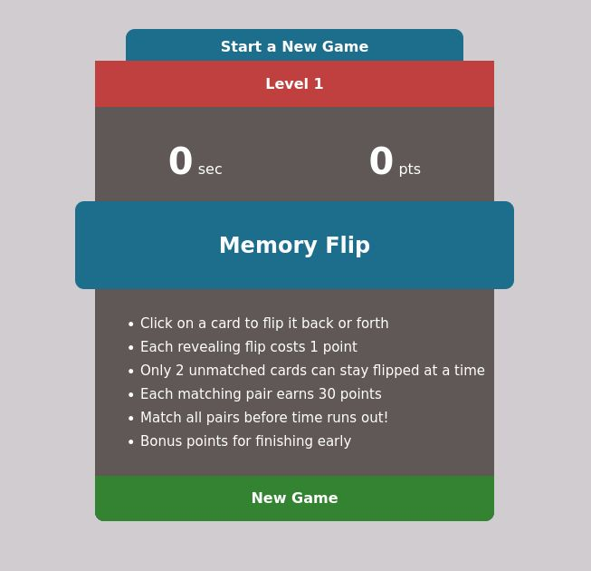
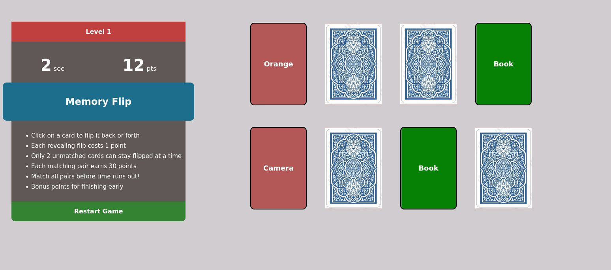
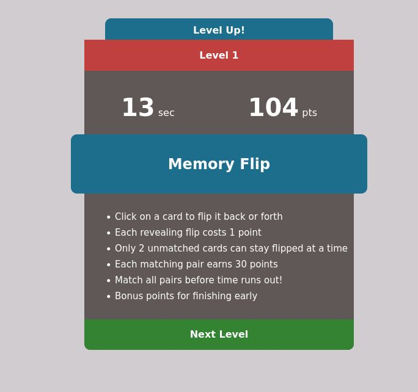
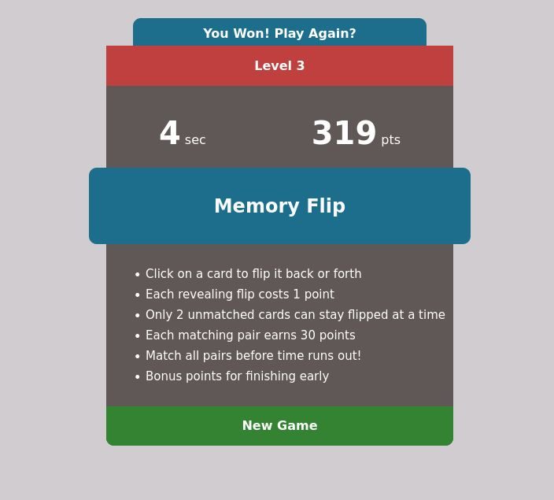
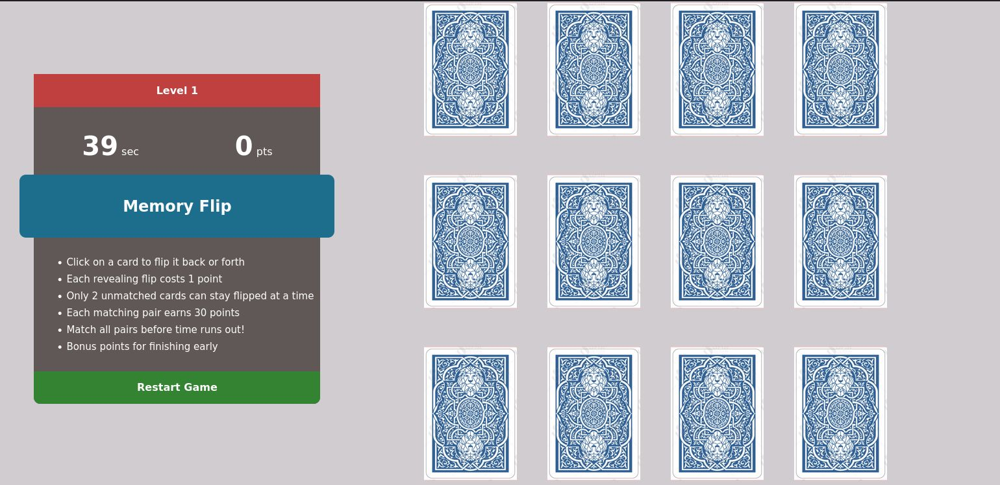
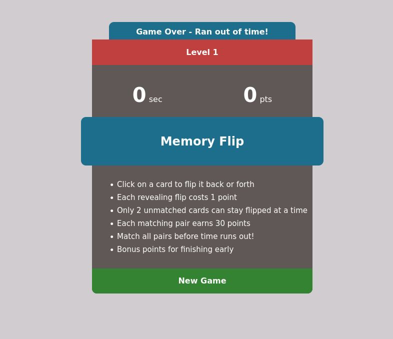

## To Play the Game

1. Launch `index.html` to render the game
2. Optionally, to customize the number of matching pairs of cards in the game, set the URL parameter `difficulty`. 
    
    For example, to start a game with 5 pairs i.e. 10 cards, add the difficulty parameter like so: `?difficulty=5`. 
    
    So, the URL would look like: https://file/is/here/index.html?difficulty=5

    By default, 4 pairs (8 cards) are rendered.
3. Game instructions are displayed on the starting page

**NOTE**: Reloading the page will lose progress and start from Level 1.

**NOTE**: Execute to check-out the animations!

## Screenshots

### Start Game Page

### Playing Game

### Level Progress

### All Levels Completed

### Render with different number of cards

### Timed Out - Game Over
