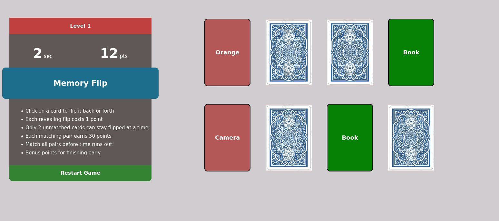

# UCS1611: Internet Programming and Web Development

Programs, reports, documentation and screenshots as part of the Internet Programming course.  
**[Compiled report](./Labwork-Documentation.pdf)** of all lab exercises.

## Card-Flip: A memory game using Vanilla HTML/CSS/JS

- [**Try out the game, NOW!!**](http://karthik-d.github.io/UCS1611-InternetProgramming-LabWork/Ex3B-MemoryGame) at http://karthik-d.github.io/UCS1611-InternetProgramming-LabWork/Ex3B-MemoryGame 
- [Source Code](https://github.com/karthik-d/UCS1611-InternetProgramming-LabWork/Ex3B-MemoryGame)

# Funded Project Tracker: A Capstone Project

Implemented with the **MERN Stack: MongoDB, ExpressJS, ReactJS (NextJS) and NodeJS**.

- [Source Code](https://github.com/karthik-d/Funded-Project-Tracker) (separte repository)
- [Project Report](./MiniProject-Report.pdf)

A centralized online system, with a web-application interface, to manage internally and externally funded projects affiliated to the college. It handles the following key aspects:

- Resource management and repurposing for funded research project.
- Project status, updates and outcomes repository for all projects
- Filterable and customized summary stats of faculty and student projects.

## Other Exercises

In addition, the following webpages/webapps are implemented.

1. [Personal Webpage with HTML/CSS](https://github.com/karthik-d/UCS1611-InternetProgramming-LabWork/Ex1-PersonalWebpage-HTML).
   - [Preview it here](http://karthik-d.github.io/UCS1611-InternetProgramming-LabWork/Ex1-PersonalWebpage-HTML)
2. [#1 extended with HTML Registration Form with JS for Data Validation, Form Expiry](/Ex3A-Form%2BJS).
3. [#2 extended with Java Servlets](./Ex4-SkillTest_Servlet).
4. [#3 extended with Servlet Sessions, Cookies and Hidden Form Forwarding](./Ex5-Sessions).
5. [#4 extended with AJAX for Asynchronous Form Validation](./Ex6-AJAX).
  
6. [Personal Webpage using ReactJS](./ex7-personal-page-with-react).
7. [Dynamic Form Validation using ReactJS](./l01-react-jsx).
7. [React Routing](./l02-react-routing).
